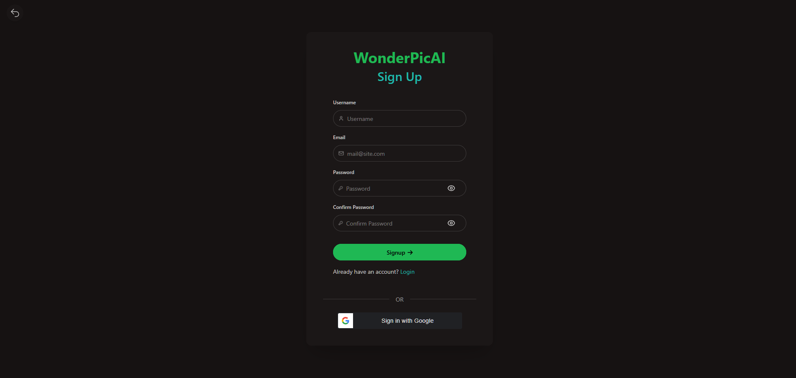

# 🎨 AI Image Generator Web App - WonderPicAI

A **server-side rendered web application** built in **Go**, allowing users to **generate AI images**, manage a personal gallery, and purchase credits — all within a clean, modular architecture built for scalability and flexibility.


## 🚀 Overview

This portfolio project showcases a modern SSR (server-side rendered) web application using Go and a modular architecture inspired by **Clean Architecture** and **Ports and Adapters (Hexagonal)** principles.

The app is fully functional with:

* 🔐 Authentication (email/password & Google Sign-In)
* 🖼️ Image generation interface powered by AI
* 💳 Stripe integration for purchasing credits
* 🧭 Clean UX with toast notifications, error pages, and a dynamic gallery


## 🧱 Tech Stack

* **Backend:**

  * [Go](https://golang.org/)
  * [Chi](https://github.com/go-chi/chi) – Lightweight, idiomatic HTTP router
  * [Gorm](https://gorm.io/) – ORM for database access
  * [ComfyLite](https://github.com/CP-Payne/ComfyLite) – Modular wrapper for ComfyUI (image generation)

* **Frontend:**

  * [HTMX](https://htmx.org/) – Dynamic frontend interactivity with minimal JS
  * [Templ](https://templ.guide/) – Component-based HTML templating for Go
  * [TailwindCSS](https://tailwindcss.com/) + [daisyUI](https://daisyui.com/) – UI design system and components

* **Architecture:**
  * Ports and Adapters (Hexagonal)


## 📸 Screenshots

### Landing Page
 
 


### Auth pages

 
 


### Image Generation Page

 

### Credits Page

 

### Stripe Checkout Page
 


### Error Page 

 
The error message and heading can easily be modified per error. There is also custom toasts, such as success, info, error and warning, which also has customisable text when called. Furthermore, all input from the user are validated. If validation fails, then appropriate messages will be displayed below the input boxes.


## WonderPicAI C4 Model Diagrams

### 1. System Context Diagram (Level 1)
<p align="center">
  
</p>

### 2. Container Diagram (Level 2)
<p align="center">
  
</p>

### 3. Component Diagram (Level 3 - SSR Web Application)
<p align="center">
  
</p>

## 🧠 Key Features

* 🧩 **Modular Architecture** – Built using interfaces, ensuring that components like AI generation can be swapped without changing the core app.
* 🖼️ **ComfyLite API** – A lightweight, modular API for [ComfyUI](https://www.comfy.org/), designed to be easily replaceable or upgradable.
* 🔒 **Authentication** – Login/Register with password or Google Sign-In (JWT-based)
* 💳 **Credits System** – Stripe integration for purchasing generation credits
* 🖍️ **Gallery** – Each user has a personal gallery to view previously generated images
* ✉️ **Toasts & Error Pages** – User feedback via UI notifications and graceful error handling


## 🔄 Planned Enhancements

While the current app is functional and showcase-ready, I plan to add:

* ✅ **Email Verification**
  * Prevents unintended account access due to unverified ownership
* ⚙️ **Settings Page**
  * Change password, email, and manage account preferences


## 🧰 Project Setup

To get WonderPicAI up and running, follow these steps:

### Prerequisites

Before you begin, ensure you have the following installed:

  * **Go (Golang)**: The backend is built with Go.
  * **[ComfyUI](https://www.comfy.org/)**: An open-source image generation system. WonderPicAI interacts with it via ComfyLite.
  * **[ComfyLite](https://github.com/CP-Payne/ComfyLite)**: A lightweight Go-based REST API wrapper for ComfyUI. This acts as the bridge between WonderPicAI and ComfyUI.
  * **Docker** (Optional, but recommended for database setup): If you plan to use `docker-compose.yml` for the PostgreSQL database.

### Installation and Setup

1.  **Clone the repository:**

    ```bash
    git clone https://github.com/CP-Payne/wonderpicai.git
    cd wonderpicai/WonderPicAI-development
    ```

2.  **Set up the database (using Docker Compose):**
    If you have Docker installed, you can easily spin up a PostgreSQL database:

    ```bash
    docker-compose up -d db
    ```

    This will start a PostgreSQL container named `postgres-db` with the following default credentials:

      * **Database**: `wonderpicai_db`
      * **User**: `postgres`
      * **Password**: `postgres`
        You can customize these in `docker-compose.yml`. The application's `main.go` connects to the database using a DSN, which is constructed from environment variables (see `internal/config/config.go`).

3.  **Configure Environment Variables:**
    Create a `.env` file in the root of the project (`WonderPicAI-development/`) based on `internal/config/config.go`. At minimum, you'll need to configure database, JWT, and ComfyLite settings.

    ```
    APP_ENV=development
    PORT=8080
    LOG_LEVEL=debug

    DB_HOST=localhost
    DB_PORT=5432
    DB_USER=postgres
    DB_PASSWORD=postgres
    DB_NAME=wonderpicai_db
    DB_SSLMODE=disable
    DB_TIMEZONE=UTC

    JWT_SECRET_KEY="your_jwt_secret_key_here_at_least_32_bytes_long"
    JWT_ISSUER=wonderpicai
    JWT_EXPIRY_MINUTES=60

    COMFYLITE_HOST=127.0.0.1
    COMFYLITE_PORT=8081

    STRIPE_SECRET=your_stripe_secret_key
    STRIPE_WEBHOOK_VERIFICATION_SECRET=your_stripe_webhook_secret

    GOOGLE_CLIENT_SECRET=your_google_client_secret
    ```

    Replace placeholder values with your actual secrets. For `JWT_SECRET_KEY`, ensure it's a strong, randomly generated string at least 32 bytes long. The application is still runnable without configuring `stripe`, `comfylite`, and `google` related environment variables, however, the Stripe integration, image generation, and google SigniIn in features will not work. You will be able to log in manually, view previously generated images (for a new setup there will not be any images unless you add it manually to the database), view the credits page and view the landing page.


4.  **Install Go dependencies:**
    Navigate to the project root and download the Go modules:

    ```bash
    go mod tidy
    ```

5.  **(Optionally) Install Frontend Dependencies (if you want to modify frontend assets):**
    The frontend uses TailwindCSS and daisyUI, managed via Node.js. If you plan to make changes to the CSS, you'll need Node.js and npm/yarn installed.

    ```bash
    cd web
    npm install
    ```

    The project uses `tailwindcss` and `daisyui` as dev dependencies, and `@tailwindcss/cli` as a dependency.

6.  **Run the application:**
    You can run the Go application directly from the project root:

    ```bash
    go run cmd/app/main.go
    ```

    The application will start on the port defined in your `PORT` environment variable (default: `8080`).


## 🧩 About ComfyLite

[**ComfyLite**](https://github.com/CP-Payne/comfylite) is a lightweight **Go-based REST API wrapper** around [ComfyUI](https://www.comfy.org/), an open-source image generation system.

It was created to:

* Serve as a **decoupled bridge** between the SSR web app and the local image generation engine
* Expose a simple REST API for submitting prompts, image size, and batch settings
* Internally handle **WebSocket communication** with ComfyUI to track generation progress and retrieve results
* Be **model-agnostic** — the web app doesn't care what generation backend is used, as long as it implements the expected interface


Because the web app is built around interfaces (via Ports and Adapters), ComfyLite can be swapped out for a different backend (e.g., a hosted service or another local model) **without changing the core application logic**.

> For implementation details, see the [ComfyLite repository](https://github.com/CP-Payne/ComfyLite)


## 📌 Important Notes

* This project is a **portfolio demonstration**, not a commercial product
* It was built to highlight:

  * My backend engineering skills (Golang, clean architecture)
  * Ability to build full-featured apps with modern frontend UX (HTMX, Tailwind, SSR)
  * Integration of real-world systems (Stripe, Google Auth, AI inference)

## 📫 Contact

If you're a recruiter or fellow developer interested in discussing this project, feel free to reach out:

* LinkedIn: [Charles Payne](https://www.linkedin.com/in/charles-p-payne/)
* Email: [charlpayne1@gmail.com](mailto:charlpayne1@gmail.com)


